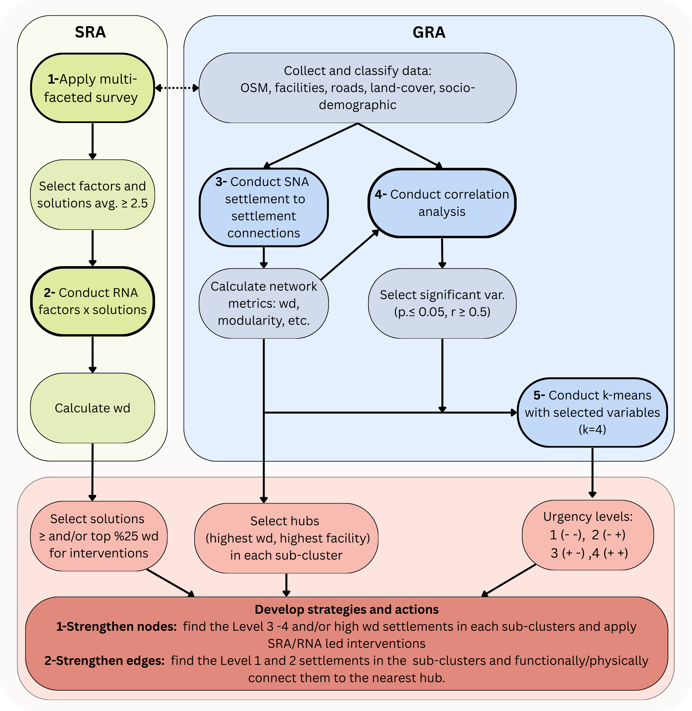

# A Network-Based Hybrid Resilience Assessment on Rural Shrinkage in Germany and Türkiye

**Author:** [Author Name(s)]

**Year:** 2025

**Study Context:** Comparative Analysis of Rural Resilience in Lüneburg Region (Germany) and Trakya Region (Turkey)

---

## Overview

This repository contains replication data, analysis scripts, and supplementary materials for the study **"A Network-Based Hybrid Resilience Assessment on Rural Shrinkage in Germany and Türkiye"**.

The research introduces a **multi-faceted, network-based hybrid resilience assessment method** to address rural shrinkage challenges. The methodology integrates two complementary analytical streams and their five analysis steps:

- **SRA (Specified Resilience Assessment)**:
  - multi-faceted survey gathers qualitative insights such as place-based risks, solutions, institutional roles and success
  - relational network analysis (RNA) examines interdependence of complex factors and leverage points.
- **GRA (General Resilience Assessment)**:
  - spatial network analysis (SNA) is used to assess spatial connectivity patterns
  - correlation analysis to identify significant variables
  - k-means clustering to distinguish settlement vulnerabilities

The study compares two regions and four district level cases across Germany and Turkey.

---

## Methodology Workflow

The diagram below illustrates the complete analytical pipeline integrating survey-based, geospatial, and spatial network approaches:



---

## Repository Structure

```
multi-faceted-network-based-resilience-assessment/
├── data/                          # Input datasets and documentation
│   ├── 02_relational_network/     # Factors-solutions network data (DE/TR)
│   ├── 03_spatial_network/        # Road network data (6 cases)
│   ├── datasets/                  # Attribute datasets
│   ├── shapefiles/                # GIS boundary polygons
│   ├── data_dictionary.pdf        # Variable definitions and sources
│   └── data_harmonization.pdf     # Cross-country harmonization methodology
│
├── notebooks/                     # Jupyter analysis notebooks
│   ├── RN_analysis.ipynb          # Relational network robustness analysis
│   └── K_means.ipynb              # K-means clustering and stability analysis
│
├── scripts/                       # Analysis scripts
│   ├── SNA_robustness.py          # Spatial network weighting robustness (Python)
│   └── correlation_analysis.r     # Correlation analysis with FDR correction (R)
│
├── nbra/                          # Python package for network analysis
│   ├── network_analysis.py        # Core RNA functions
│   └── ari_test.py                # Clustering robustness utilities
│
├── results/                       # Analysis outputs
│   ├── 01_SRA_survey/             # Survey forms and reliability tests
│   ├── 02_relational_network/     # RNA robustness results
│   ├── 03_spatial_network/        # SNA weighting robustness
│   ├── 04_correlation/            # Correlation matrices and Moran's I tests
│   └── 05_kmeans/                 # Clustering results and stability metrics
│
├── documents/                     # Methodology documentation
│   └── workflow.jpg               # Analytical workflow diagram
│
├── pyproject.toml                 # Python dependencies (uv)
└── README.md                      # This file
```

---

## Installation

### Prerequisites

- **Python:** >= 3.13, < 3.14
- **uv:** Python package manager ([installation guide](https://docs.astral.sh/uv/))
- **R:** (for correlation analysis)

### Setup

1. **Clone the repository:**

```bash
git clone <repository-url>
cd network-based-resilliience-assessment
```

2. **Install uv (if not installed):**

```bash
curl -LsSf https://astral.sh/uv/install.sh | sh
```

3. **Install Python dependencies:**

```bash
uv sync
```

4. **Activate virtual environment:**

```bash
source .venv/bin/activate  # Linux/Mac
# or
.venv\Scripts\activate     # Windows
```

### Python Dependencies

Managed via `pyproject.toml`:

- jupyter >= 1.1.1
- matplotlib >= 3.10.7
- networkx >= 3.5
- pandas >= 2.3.3
- scikit-learn >= 1.7.2
- scipy >= 1.16.2
- seaborn >= 0.13.2

### R Dependencies

Required for `scripts/correlation_analysis.r`:

- tidyverse
- Hmisc
- corrplot
- openxlsx

Install in R:

```r
install.packages(c("tidyverse", "Hmisc", "corrplot", "openxlsx"))
```

---

## Citation

If you use this repository or data, please cite:

**Manuscript:**

```
[Author Name(s)]. (2025). A Network-Based Hybrid Resilience Assessment on Rural Shrinkage in Germany and Türkiye. [Journal Name]. [DOI]
```

**Dataset:**

```
[Author Name(s)]. (2025). Replication Data and Scripts for
Network-Based Resilience Assessment [Data set]. [Repository DOI]
```

---

## License

This project is licensed under **CC-BY 4.0** (Creative Commons Attribution 4.0 International).

You are free to:

- Share and adapt the material
- For any purpose, including commercial use

Under the following terms:

- Appropriate credit must be given
- A link to the license must be provided
- Any changes made must be indicated

---

## Contact & Support

- **Methodology questions:** Refer to the manuscript or `data/data_dictionary.pdf`
- **Data questions:** Consult `data/data_harmonization.pdf`
- **Technical issues:** Open an issue in this repository

---
